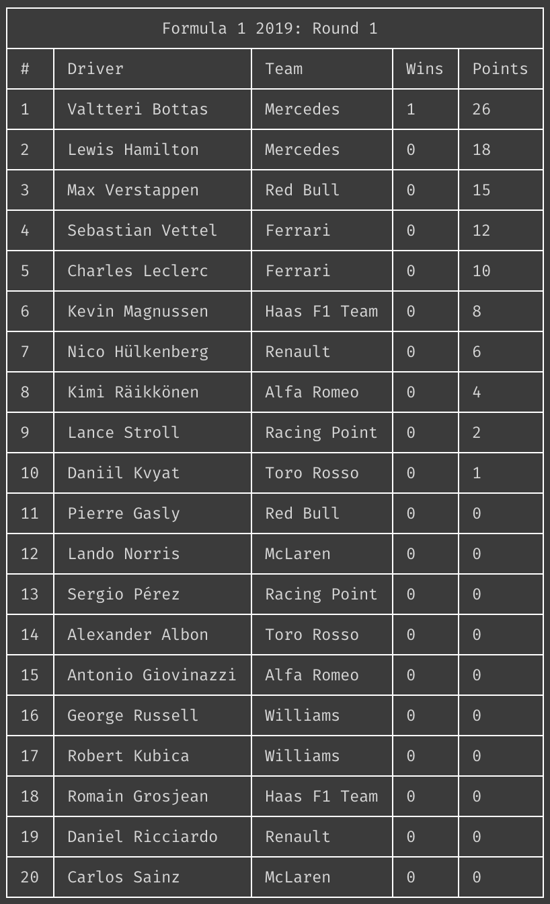

```
 ____                        __
/\  _`\                     /\ \__
\ \ \L\ \_ __   ___     ____\ \ ,_\
 \ \ ,__/\`'__\/ __`\  /',__\\ \ \/
  \ \ \/\ \ \//\ \L\ \/\__, `\\ \ \_
   \ \_\ \ \_\\ \____/\/\____/ \ \__\
    \/_/  \/_/ \/___/  \/___/   \/__/

“I’m not going to leave him even a 1-meter gap.”
```

[](https://circleci.com/gh/jameswillock/prost) [](https://www.npmjs.com/package/prost) [](https://github.com/jameswillock/prost/blob/master/LICENSE) [](https://codeclimate.com/github/jameswillock/prost/test_coverage) [](https://codeclimate.com/github/jameswillock/prost/maintainability)

## Description
Fetch and display the current Formula 1 driver standings.



## Installation
Prost is available via `npm` – merely `npm install -g prost`.

The `-c` flag will fetch and return constructor standings.

The `-d` flag (default) will fetch and return driver standings.

## Credits
- [Ergast Developer API](https://ergast.com/mrd/) – Motor Racing Developer API.
- [`axios`](https://github.com/axios/axios) – HTTP client.
- [`cli-table3`](https://github.com/cli-table/cli-table3) – Unicode tables for the command line.

## Drawbacks
- Does not support previous rounds or seasons.
- No caching, so will make an API request on every run.
